We can visualize the profiler information as different kind of graphs: `generate_dot_graphs.sh`

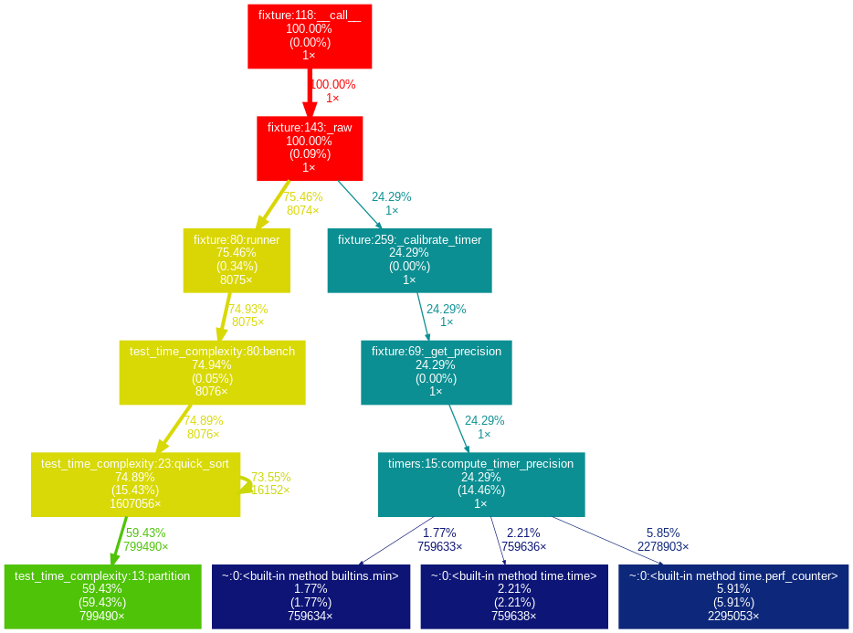
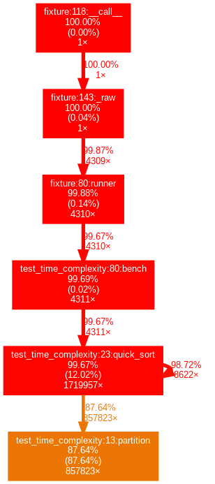
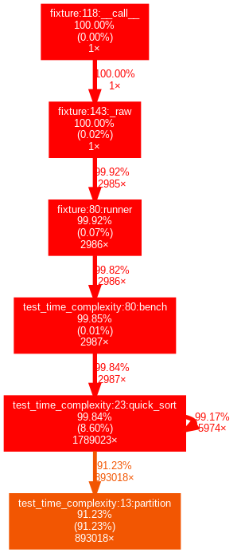
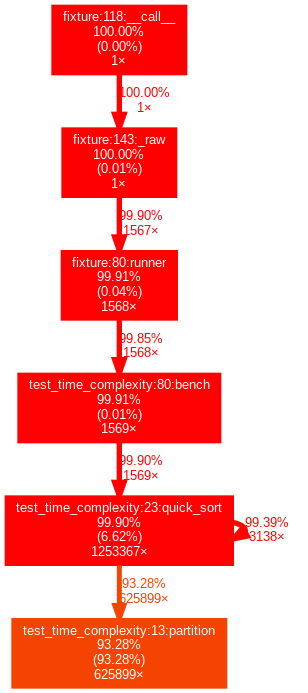

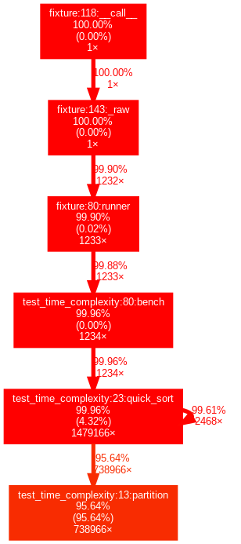

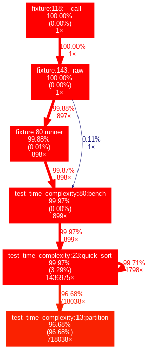

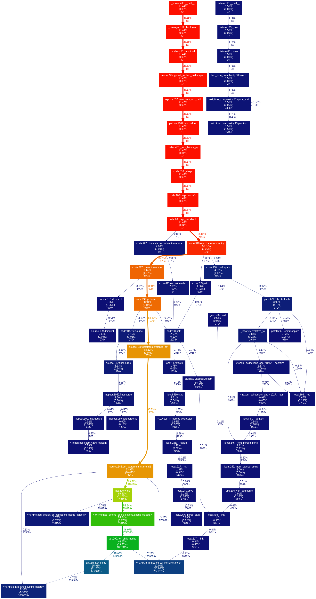

Here we can easily see the more items we sort the "hotter" the `partition` function becomes.

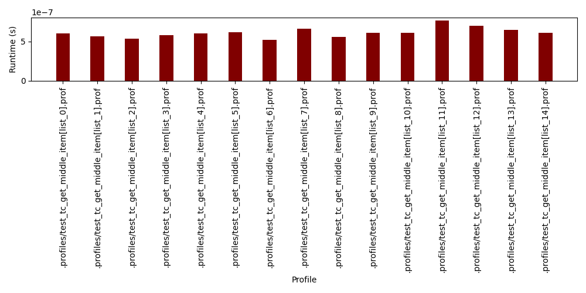

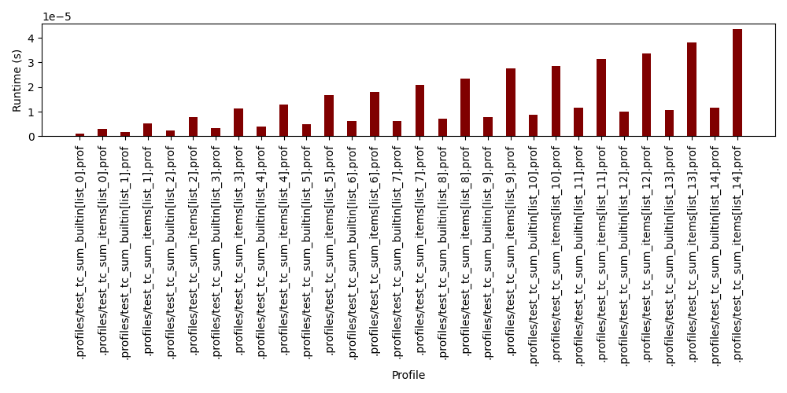

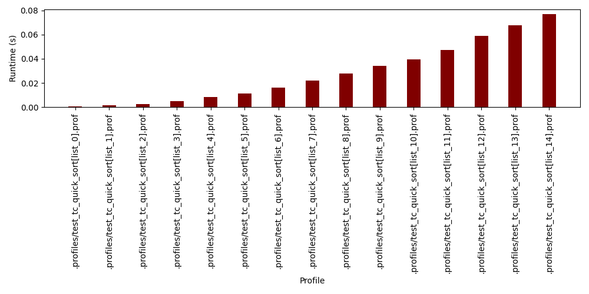

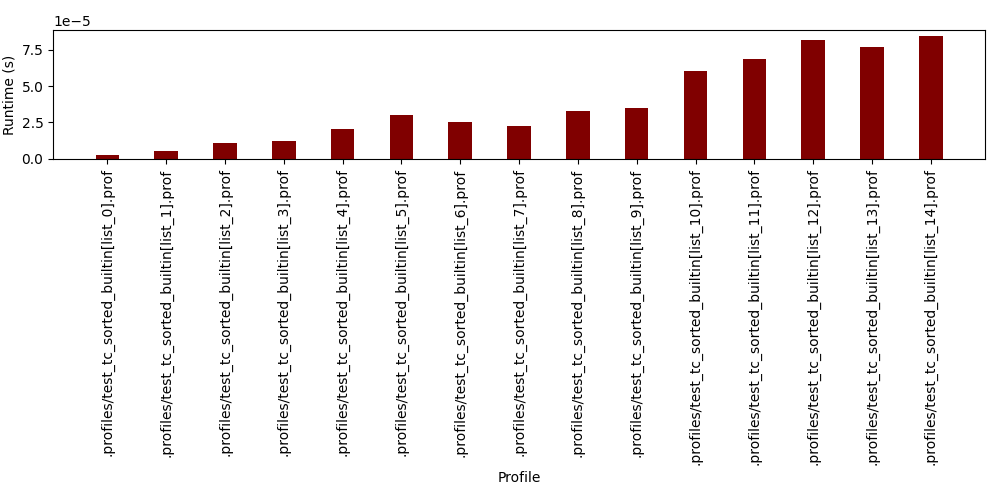
